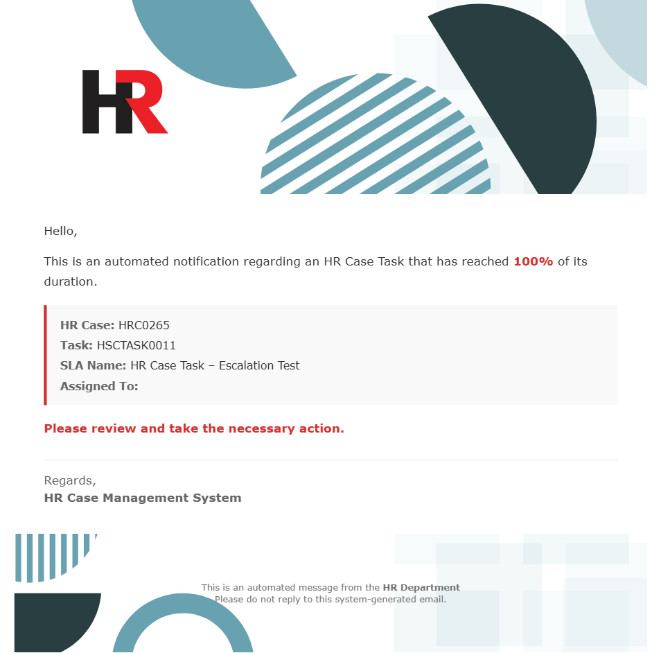

#  Custom HR Case Management System

## Project Overview

This project delivers a custom HR Case Management system built on ServiceNow to help organizations efficiently manage employee requests without the need to purchase the full HR Service Delivery module.

The solution enables employees to submit HR requests through structured record producers, automatically routes cases to the appropriate assignment groups based on category, and supports approval workflows for specific request types. HR teams can manage cases through task breakdowns, while managers can review and approve requests when required.

The system incorporates end-to-end automation including case task creation, SLA-based escalation, notification workflows, and event-driven processes to ensure timely handling of requests. It also includes dashboards and reporting to provide visibility into HR operations and performance.

Overall, the solution provides structured case tracking, automated workflows, clear status management, and improved operational transparency, helping HR teams deliver faster, more organized, and more reliable support to employees.

---

### HR Use Cases Covered

The system supports common HR scenarios such as:

- Onboarding & Offboarding
- Leave & Payroll Requests
- Travel & Relocation Support
- General HR Queries (Others)

Each scenario follows a straightforward flow:  
**Submit → Automated Routing → Approval → Task Fulfillment → Resolution → Closure**

### Main Entities Involved

- **Employees** — Submit HR requests through record producers
- **HR Team / Resolvers** — Manage and fulfill assigned tasks
- **Managers** — Review and approve sensitive or categorized requests
- **HR Operations** — Receive notifications and monitor escalations
- **System Automation Engine** — Handles routing, task creation, SLA tracking, and notifications

### How It Works (Simple Flow)

1. Employee submits a case using *Create HR Case* or *My HR Query*.
2. System routes the case to the appropriate HR group based on category.
3. Manager approval happens automatically for onboarding, offboarding, leave, and travel cases.
4. HR team receives a fulfillment task after approval and works on it.
5. SLA timers begin tracking response and resolution time with escalation triggers.
6. HR team completes the task and sets it to **Closed Complete**.
7. The parent HR Case automatically transitions to **Resolved**.
8. Notifications and events keep stakeholders informed throughout the lifecycle.

### Screenshot / Diagram Suggestions

1. **HR Case Creation Form**  
(Shows how employees submit requests)  

2. **Manager Approval Screen**  
(Shows how managers approve or reject)  

3. **Fulfillment Task View & SLA Escalation for HR**  
(Shows task assignment and SLA tracking)  

4. **Case Progress Dashboard**  
(Shows how HR monitors open and resolved cases)  

5. **Notification Examples**  
(Email showing case updates)  

6. **End-to-End Case Lifecycle Diagram**  
(Visual summary of the entire journey)  

### Key Features

- Structured Employee Case Submission via Record Producers
- Automatic Assignment Group Routing
- Built-in Approval Workflows
- Automated HR Case Task Creation
- SLA Tracking with Escalation Logic
- Event-Driven Notifications
- Parent-Child Case Synchronization
- Dashboards & Reporting for Operational Insights
- REST Integration for external data lookup
- Source Control Integration with GitHub

### Example Outputs

These components were part of the final delivered solution:

1. **HR Case Form**  
Captures structured request details and categorization.

2. **Approval Workflow**  
Ensures governance for sensitive requests.

3. **Fulfillment HR Case Task**  
Assigned to HR teams with clear instructions.

4. **Resolution & Feedback**  
Automatically updates case status upon task completion.

### Value & Outcomes

The system improves HR operations by:

- Eliminating manual email-based request tracking
- Automating routing and approvals
- Improving response times through SLA tracking
- Increasing accountability with task ownership
- Providing full lifecycle visibility
- Enhancing transparency through notifications
- Supporting auditability via case history
- Delivering a cost-effective alternative to HRSD

### Tools Used

- **ServiceNow Platform**
  - Custom Tables (HR Case, HR Case Task)
  - Record Producers
  - Flow Designer Automation
  - Business Rules
  - Notifications & Email Templates
  - SLA Definitions & Escalation
  - Event Registry
  - REST Integration
  - Access Controls (ACLs)
- **Reporting & Dashboards**
  - Case Monitoring
  - Operational Metrics
- **Source Control**
  - GitHub Integration via ServiceNow Studio

---

## Conclusion

This project delivers a fully automated HR Case Management solution that streamlines employee request handling through structured workflows, approval automation, SLA monitoring, and real-time notifications. By combining automation with clear operational visibility, the system enables HR teams to provide faster, more reliable support while maintaining governance and transparency.

The solution demonstrates how organizations can build scalable HR service capabilities on ServiceNow without relying on costly enterprise modules, making it both practical and extensible for future enhancements.
