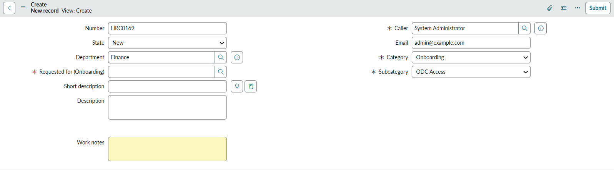
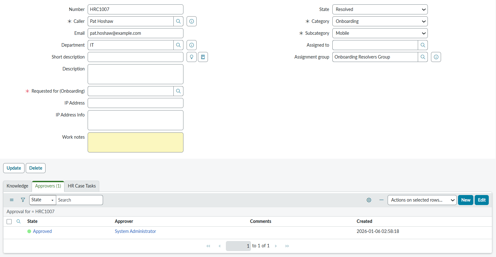
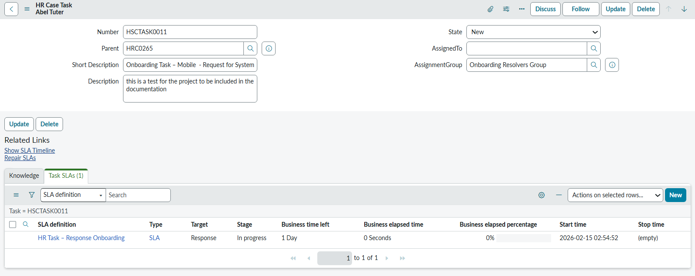
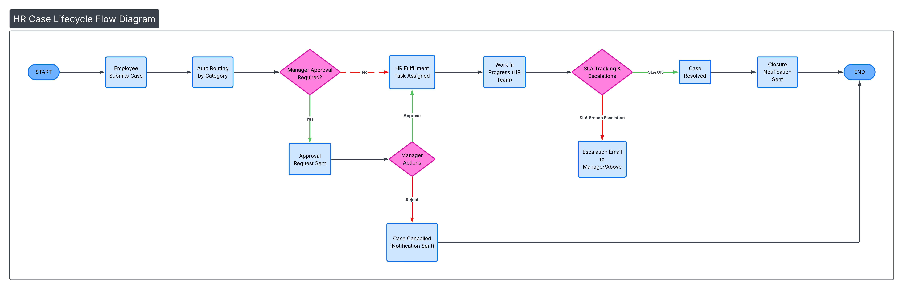

#  Custom HR Case Management System

## Project Overview

This project delivers a custom HR Case Management system built on **ServiceNow** for organizations that need to manage employee requests without purchasing the full HR Service Delivery module.

The system allows employees to submit HR-related cases, HR teams to assign and resolve them, and managers to approve certain types of requests.

The final solution includes clean case tracking, automated approvals, assigned tasks, clear status updates, and basic reporting — making HR processes more organized and transparent for everyone.

---

### HR Use Cases Covered

The system supports common HR scenarios such as:

- Onboarding & Offboarding
- Leave & Payroll Requests
- Travel & Relocation Support
- General HR Queries (Others)

Each scenario follows a straightforward flow:  
**submit → review/approval → action → closure**

### Main Entities Involved

- **Employees** (raise HR cases)
- **HR Team / Resolvers** (handle the cases)
- **Managers** (approve certain cases)
- **HR Operations** (get notified on special events)

### How It Works (Simple Flow)

1. Employee submits a case through the HR form or a simple “My HR Query” entry.
2. System routes the case to the correct HR group based on category.
3. Manager approval happens automatically for onboarding, offboarding, leave, and travel cases.
4. HR team receives a fulfillment task after approval and works on it.
5. When the task is closed, the main HR case automatically moves to **Resolved**.
6. Notifications are sent throughout the process to keep everyone informed.

### Screenshot / Diagram Suggestions

1. **HR Case Creation Form**  
(Shows how employees submit requests)  

2. **Manager Approval Screen**  
(Shows how managers approve or reject)  

3. **Fulfillment Task View for HR**  
(Shows how tasks reach HR resolvers)  

4. **Case Progress Dashboard**  
(Shows how HR monitors open and resolved cases)  

5. **Notification Example**  
(Email showing case updates with links)  

6. **End-to-End Case Lifecycle Diagram**  
(Visual summary of the entire journey)  

### Key Features

- Employee Case Submission through a simple form
- Automatic Assignment to the right HR team
- Built-in Manager Approvals (where needed)
- Task Tracking for HR teams
- Status Updates & Notifications for transparency
- Knowledge Base Articles for self-help
- Basic Dashboards & Reports for HR visibility

### Example Outputs

These components were part of the final delivered solution:

1. **HR Case Form**  
Allows employees to describe what they need.

2. **Manager Approval**  
Ensures sensitive requests have proper approval.

3. **Fulfillment Task**  
Assigned to HR teams with clear instructions.

4. **Resolution & Feedback**  
Case ends with status *Resolved* or *Cancelled*.

### Value & Outcomes

The system improves HR operations by:

- Reducing email-based case handling
- Making requester experience easier
- Simplifying approvals
- Ensuring accountability through tasks
- Tracking cases from start to finish
- Providing HR visibility through dashboards
- Serving as a cost-effective alternative to HRSD

### Tools Used

- **ServiceNow**
  - Case Form
  - Basic Workflows
  - Notifications
  - Catalog Entry
- **Dashboards**
  - Case counts
  - Case categories
- **Knowledge Base**
  - Helps users submit accurate requests

---

## Conclusion

This project delivers a clean, understandable HR Case Management solution that modernizes HR request handling without requiring complex or expensive modules. Employees, managers, and HR staff all benefit from clarity, structured workflows, and real-time visibility into case progress.
